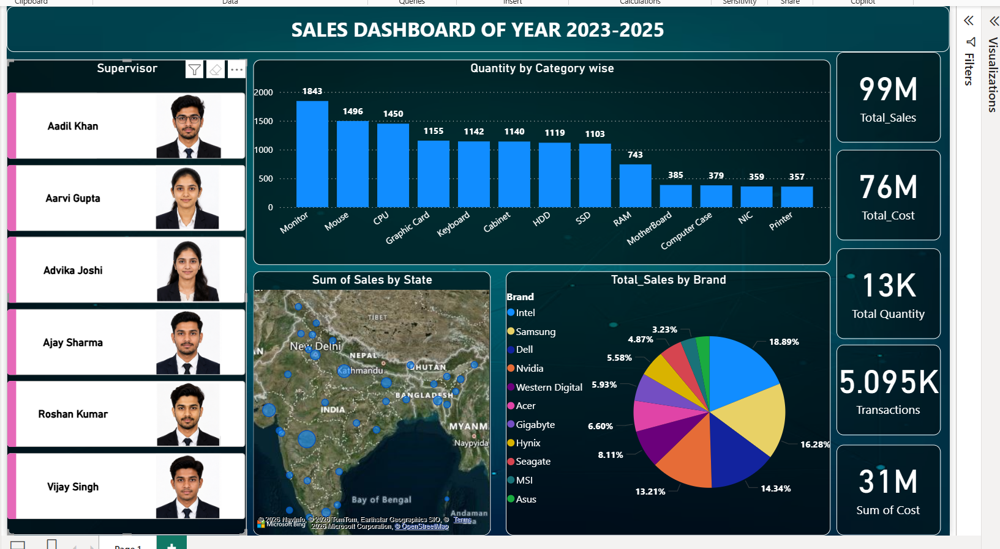

# Sales Dashboard Analysis (2023–2025)

## Project Overview

This project presents an interactive Sales Dashboard created using Power BI and Excel. The dashboard analyzes sales performance, product categories, brands, transactions, and regional sales trends from 2023 to 2025.

The objective of this project is to transform raw sales data into meaningful business insights through visualization and KPI tracking.

## Dashboard Preview

## Tools & Technologies Used

- Power BI
- Microsoft Excel
- Power Query
- Data Cleaning
- Data Visualization
- KPI Reporting

  ## Key Features

- Interactive dashboard with filters
- KPI cards for Total Sales, Total Cost, Quantity, and Transactions
- Category-wise quantity analysis
- Brand-wise sales distribution
- State-wise sales visualization using maps
- Sales performance tracking from 2023–2025

  ## KPI Metrics

- Total Sales: 99M
- Total Cost: 76M
- Total Quantity: 13K
- Transactions: 5K+

  ## Business Insights

- Monitor category showed the highest quantity sold
- Intel and Samsung contributed major sales share
- Certain states generated significantly higher sales compared to others
- Dashboard helps identify high-performing products and brands

  ## Project Files

- `Sales_Dashboard.pbix` → Power BI dashboard file
- `sales-dashboard-preview.png` → Dashboard screenshot
- `sales_data.xlsx` → Dataset used for analysis

  ## Connect With Me

LinkedIn: https://linkedin.com/in/varsha-kumari-6b1800345/

GitHub: https://github.com/VarshaKumari007/
